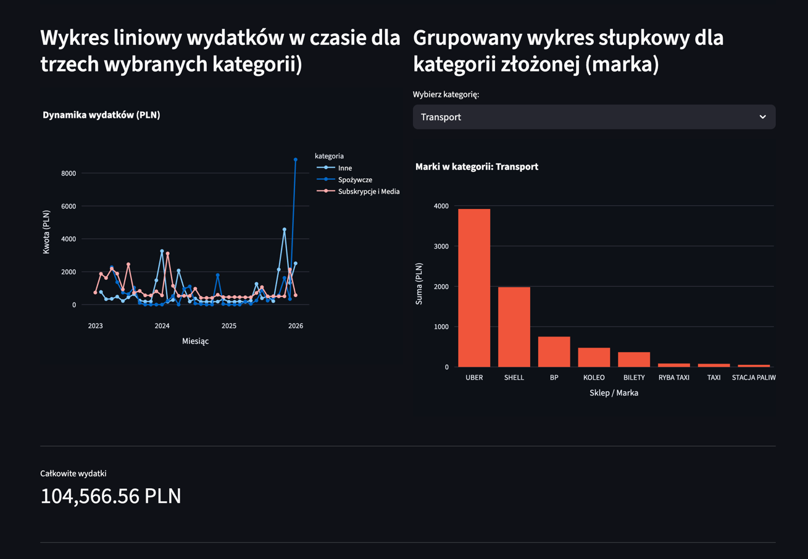
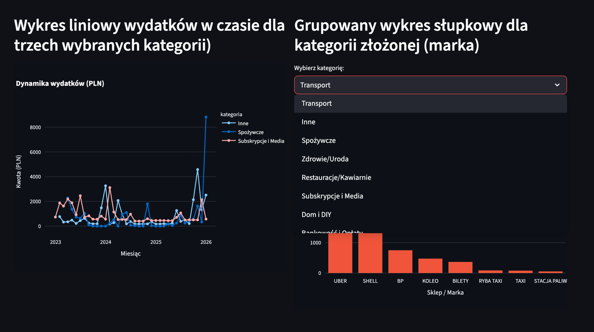
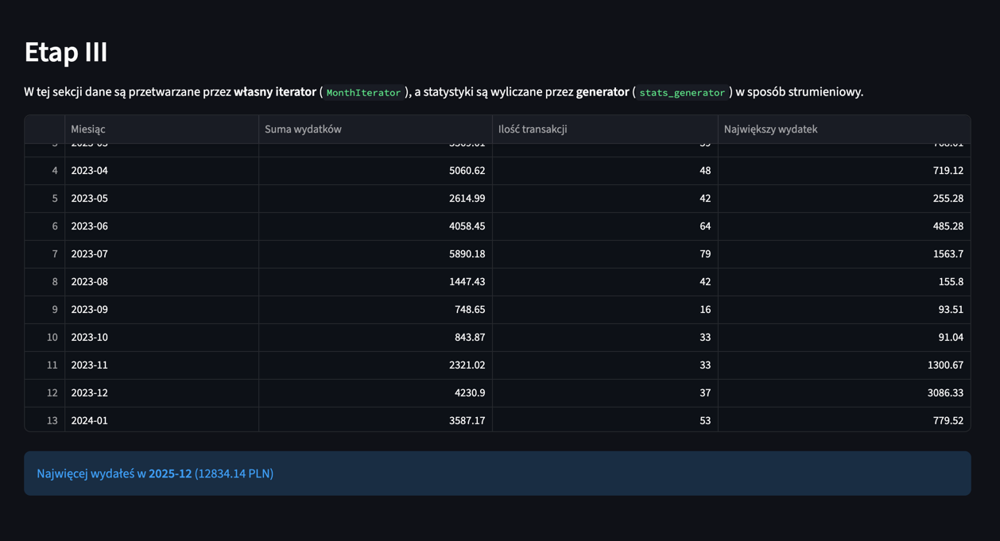

# Dashboard Analizy Wydatków
 Aplikacja analityczna służąca do procesowania, normalizacji i wizualizacji historii transakcji bankowych. Projekt realizuje założenia programowania modularnego oraz wykorzystuje zaawansowane mechanizmy języka Python do przetwarzania strumieniowego.

###  Struktura Projektu
- `app.py` – Główny punkt wejścia aplikacji (Streamlit). Odpowiada za warstwę prezentacji i interakcję z użytkownikiem.

- `data/` – Katalog zawierający surowe pliki transakcji w formacie CSV.

- `functions/` – Pakiet logiczny zawierający moduły przetwarzania danych:

- `ladowanie_i_normalizacja.py` – Proces ETL.

- `kategoryzacja_i_czyszczenie.py` – Silnik klasyfikacji oparty o wyrażenia regularne.

- `geen_i_iter.py` – Implementacja własnych struktur iterowalnych i generatorów.

### Opis Funkcjonalności
#### 1. **Normalizacja i Klasyfikacja (Regex)**

Silnik przetwarzania tekstu wykorzystuje bibliotekę re do mapowania surowych opisów transakcji na ustandaryzowane kategorie oraz nazwy marek/sklepów.

- **Proces**: Usuwanie szumu informacyjnego (lokalizacje, kody terminali, daty rozliczeń z opisu) i ekstrakcja słów kluczowych.

- **Wynik**: Transformacja zapisu typu `ZABKA Z9566 K.1, WROCLAW...` do zunifikowanej formy `ZABKA`.

#### 2. **MonthIterator (Custom Iterator)**

Klasa implementująca protokół iteratora `(__iter__, __next__)`.

- **Działanie**: Wykorzystuje `pandas.Grouper` do grupowania danych w interwałach miesięcznych.

- **Zastosowanie**: Umożliwia sekwencyjne przetwarzanie bloków danych bez konieczności ładowania całych zagregowanych struktur do pamięci w jednym kroku.

#### 3. Przetwarzanie Strumieniowe (Generators)

Funkcja `stats_generator` przyjmuje obiekt `MonthIterator` i oblicza statystyki finansowe (suma, max, count) dla każdego miesiąca.

- **Technika**: Użycie słowa kluczowego yield pozwala na zwracanie wyników "w locie", co optymalizuje zużycie pamięci przy dużych zbiorach danych.

#### 4. Wizualizacja i Interaktywność

- Ag**regacja czasowa**: Wykorzystanie metod resample i groupby do generowania szeregów czasowych.

- **Prezentacja**: Wykresy słupkowe i liniowe realizowane za pomocą biblioteki Plotly, osadzone w środowisku Streamlit.

- **Interaktywność**: Dynamiczne filtrowanie marek wewnątrz wybranych kategorii.

### Wymagania Techniczne

Wymagane biblioteki znajdują się w pliku `requirements.txt`:

- `pandas` – manipulacja danymi.

- `streamlit` – interfejs użytkownika.

- `plotly` – wizualizacje interaktywne.

### Uruchomienie
Aby uruchomić dashboard lokalnie, w terminalu wpisz:

```
streamlit run app.py
```

### Screeny:






